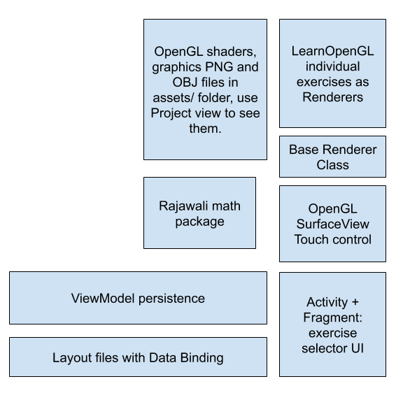

AndroidKotlinLearnOpenGL
==========================

Building
--------------------
This repo is set up to build using Android Studio 3.5 or greater.   It is written
in Kotlin.  It is important to build the project before looking at the code closely 
in Android Studio.  Both the Data Binding and the Navigator frameworks generate code
that is called directly by the project.   <b>These calls will show as undefined before the
project is built!!</b>

Emulators and devices
----------------------
When displaying in an emulator - enable the higher level of OpenGL ES.

GLESDynamicVersion = on

to ~/.android/advancedFeatures.ini 

For more information on this emulator configuration see the MISC.md file.

Current Status
---------------
Exercises are operational through Instancing.  Basic camera manipulation is 
included and is implemented only for movement in the x and z direction.
The camera movement leverages the Quaternion implementation of Rajawali.

Architecture diagram
--------------------

Sample Screenshot
-----------------

Exercise Descriptions
=============

The project implements the following exercises in descending complexity.  The exercises are adapted 
for Android, OpenGL ES3+, and are implemented in Kotlin.

It also borrows from 
the camera.h located at:

https://learnopengl.com/code_viewer_gh.php?code=includes/learnopengl/camera.h

Renderer4103AdvancedAsteroidsInstanced
--------------------------------------
Tutorial URL: https://learnopengl.com/Advanced-OpenGL/Instancing

Code link URL: https://learnopengl.com/code_viewer_gh.php?code=src/4.advanced_opengl/10.3.asteroids_instanced/asteroids_instanced.cpp

Uses a Matrix4 instance array and the associated hacks to set up 4 vector4 attributes to import the 
Matrix4 into the shader.  TODO:  replace this ugly hack with a modern buffer if that works 
in the emulator and phone.

Renderer4102InstancingHacking
-----------------------------
No tutorial for this - this was a variation on "Renderer4101InstancingQuads" to add an OBJ based 
rendering with an instanced based renderer and work through the shader mechanics.

This works for hacking the patches based on instance:

    void main()
    {
        fColor = aColor;
        float myfloat = float(gl_InstanceID+1);
        vec2 pos = aPos * myfloat;
        gl_Position = vec4(pos + aOffset, 0.0, 1.0);
    }

Renderer480AdvancedGlslUBO
--------------------------
Tutorial URL: https://learnopengl.com/Advanced-OpenGL/Advanced-GLSL

Code link URL: https://learnopengl.com/code_viewer_gh.php?code=src/4.advanced_opengl/8.advanced_glsl_ubo/advanced_glsl_ubo.cpp

Use of simple Uniform Buffer Object  - in this case to pass in the
projection and view matrices to the common shader.

    layout (std140) uniform Matrices
    {
        mat4 projection;
        mat4 view;
    };

Notes:  code needs further cleanup as I left parts of the instancing project in the
original for use in debugging.   This should get stripped out at some point.

Renderer242LightingMapsPlusCubeObject
---------------------------
No tutorial for this.  It is a variation on Renderer242LightingMapsSpecular 
and adds in an OBJ based cube to test integration of OBJ rendering into the scene.

Renderer242LightingMapsSpecular
---------------------------
Tutorial URL: https://learnopengl.com/Lighting/Lighting-maps

Code link URL: https://learnopengl.com/code_viewer_gh.php?code=src/2.lighting/4.2.lighting_maps_specular_map/lighting_maps_specular.cpp

Excellent tutorial on lighting combined with textures.

Renderer174Camera
-------------------
Tutorial URL: https://learnopengl.com/Getting-started/Camera

Code link URL: https://learnopengl.com/code_viewer_gh.php?code=src/1.getting_started/7.4.camera_class/camera_class.cpp

Renderer163CoordinateSystems
----------------------------
Tutorial URL: https://learnopengl.com/Getting-started/Coordinate-Systems

Code link URL: https://learnopengl.com/code_viewer_gh.php?code=src/1.getting_started/6.3.coordinate_systems_multiple/coordinate_systems_multiple.cpp

Renderer121HelloTriangle
-------------------------
Tutorial URL: https://learnopengl.com/Getting-started/Hello-Triangle

Code link URL: https://learnopengl.com/code_viewer_gh.php?code=src/1.getting_started/2.1.hello_triangle/hello_triangle.cpp

The "hello world" basics in the learnopengl.com style.   But adapted to Android and 
OpenGL ES and Kotlin instead of a PC and a GPU and C++.

GoogleSampleRenderer
---------------------

Android OpenGL Triangle and Square sample

Tutorial URL:  https://developer.android.com/training/graphics/opengl

This is the basic "Hello Opengl" introduction - just the basics.   It is included for
comparisons to code styling to the learnopengl methodology.

Project notes
=============

Android Framework
-----------------
The Android application framework is one Activity and multiple Fragments - one for each major section
in the learnopengl "coursework".  The framework also includes modern Android techniques - more
can be learned about these techniques in the excellent Udacity course:

https://classroom.udacity.com/courses/ud9012

- Databinding
- ViewModel with LiveData controls

Imported content
----------------
The project does not use any supporting graphics libraries aside what is built into the 
Android Framework.  The math support is provided by the Rajawali Math modules. 
The modules are converted to kotlin and are located in the java/org/rejawali3d subtree.
    
See also the Github repo:

https://github.com/Rajawali/Rajawali